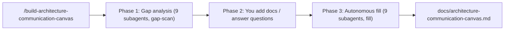

# The Last Architect

**The Last Architect** equips coding agents with reusable guidance for architectural work - so your agent ([Cursor](https://cursor.com/docs) or [Claude Code](https://code.claude.com/docs)) can genuinely assist software and solution architects and development teams, not just write code. It is a growing toolbelt of skills and subagents, each focused on one architecture task and installable on its own.

## Tools on the belt

- **build-architecture-communication-canvas** *(first tool)* - fill out the [arc42 Architecture Communication Canvas (ACC)](https://canvas.arc42.org/architecture-communication-canvas) for **any** repository, straight from your coding agent. It analyzes a codebase as a **black box** - no assumptions about language, framework, or layout - and produces a single, evidence-backed Markdown file with all nine ACC sections filled in. See a [sample canvas](build-architecture-communication-canvas/example-architecture-communication-canvas.md) for what the output looks like.

More tools (e.g. architecture review) will follow as additional top-level folders. The rest of this README covers the first tool, **build-architecture-communication-canvas**.

## What is the Architecture Communication Canvas?

The ACC is "the shortest possible description of your architecture." It captures nine elements grouped into three areas:

| Requirements (what) | Solution (how) | Problems & risks |
| --- | --- | --- |
| Value Proposition | Business Context | Risks and Missing Information |
| Key Stakeholder | Components / Modules | |
| Core Functions | Core Decisions (Good or Bad) | |
| Quality Requirements | Technologies | |

## How it works

The toolkit runs in three phases, invoked by a single command:

```
/build-architecture-communication-canvas
```

1. **Gap analysis** - nine readonly category subagents scan the repo in parallel and report what is derivable from the code versus what is missing. The orchestrator merges this into a single *Missing Inputs Report*.
2. **Input collection** - you add the missing pieces: drop in strategy/Business Model Canvas docs, ADRs, etc. (or point to paths), and/or answer the gap questions inline. This is the only step that needs you.
3. **Autonomous fill** - the same nine subagents run again in `fill` mode using the repo plus whatever you provided, then the orchestrator assembles `docs/architecture-communication-canvas.md`. Anything still unknown is written as a clearly-marked `> TODO (human input needed)` placeholder - never invented.



### Why subagents + skills?

- **Subagents** (Cursor [docs](https://cursor.com/docs/subagents) / Claude Code [docs](https://code.claude.com/docs/en/sub-agents)) give each category its own context window, so the noisy repo scanning never bloats the main conversation. One subagent per category keeps the work transparent and independently improvable.
- **Skills** (Cursor [docs](https://cursor.com/docs/skills) / Claude Code [docs](https://code.claude.com/docs/en/skills)) carry the reusable knowledge (canvas template, discovery heuristics, question bank) and load progressively. The entrypoint is a skill with `disable-model-invocation: true`, so it installs via the skills standard but is still invoked as `/build-architecture-communication-canvas`.

## Black-box guarantee

The analysis makes **zero assumptions** about the repo:

- No assumed language, framework, build tool, or runtime - ecosystems are detected from whatever manifest/config files actually exist.
- No assumed directory layout or repo shape - handles monorepos, polyglot repos, docs-only, infra-only, or near-empty repos.
- Evidence-or-gap rule - every statement cites a real artifact; absent signals become honest "not determinable from the repository" notes.

## Install

The `install.sh` script copies the toolkit's skills and subagents into the right place for your coding agent. Pick one or more agents (`--cursor`, `--claude`) and exactly one scope (`--user` for all your projects, `--target <dir>` for a single project).

### Option A - run directly from GitHub (no checkout needed)

```bash
# Cursor, user-scoped (all your projects):
curl -fsSL https://raw.githubusercontent.com/andiveloper/the-last-architect/main/install.sh | bash -s -- --cursor --user

# Claude Code, into a specific project:
curl -fsSL https://raw.githubusercontent.com/andiveloper/the-last-architect/main/install.sh | bash -s -- --claude --target /path/to/your/project
```

### Option B - from a local checkout

```bash
git clone https://github.com/andiveloper/the-last-architect.git
cd the-last-architect

# Cursor + Claude Code into another project (project-scoped):
./install.sh --cursor --claude --target /path/to/your/project

# Or user-scoped (all your projects):
./install.sh --cursor --user
```

Per agent, the script installs into:

| Agent | Flag | Skills | Subagents |
| --- | --- | --- | --- |
| Cursor | `--cursor` | `<base>/.cursor/skills/` | `<base>/.cursor/agents/` |
| Claude Code | `--claude` | `<base>/.claude/skills/` | `<base>/.claude/agents/` |

where `<base>` is `$HOME` (`--user`) or your `--target` directory. Run `./install.sh --help` for all options.

## Usage

1. Open the repository you want to document in your coding agent (Cursor or Claude Code).
2. Run `/build-architecture-communication-canvas`.
3. Answer the Missing Inputs Report (add docs or answer questions, or skip).
4. Review `docs/architecture-communication-canvas.md` and resolve any `TODO (human input needed)` placeholders.

## What's in this repo

The toolkit is agent-neutral: source files live in a single top-level folder and `install.sh` maps them into each coding agent's directories. Future toolkits (e.g. `architecture-review/`) will be added as sibling top-level folders.

```
build-architecture-communication-canvas/         # the ACC tool (first on the belt)
  skills/
    build-architecture-communication-canvas/      # orchestrator entrypoint
    arc42-acc-canvas/                              # canvas template + conventions
    repo-discovery/                                # black-box discovery heuristics
    acc-gap-analysis/                              # inputs catalog + question bank
  agents/
    acc-value-proposition.md ... acc-risks-missing-info.md   # 9 category subagents
  example-architecture-communication-canvas.md    # sample output
install.sh
```

## Example output

See [build-architecture-communication-canvas/example-architecture-communication-canvas.md](build-architecture-communication-canvas/example-architecture-communication-canvas.md) for a filled-in sample.

## License

[MIT](LICENSE)

## Credits

The Architecture Communication Canvas is by Gernot Starke, Patrick Roos and arc42 contributors - <https://canvas.arc42.org/architecture-communication-canvas>.
