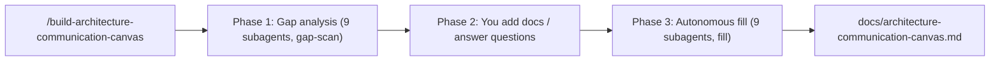

# The Last Architect

Fill out the [arc42 Architecture Communication Canvas (ACC)](https://canvas.arc42.org/architecture-communication-canvas) for **any** repository, straight from Cursor.

The Last Architect is a Cursor toolkit (one orchestrator skill, nine category subagents, and a few shared knowledge skills) that analyzes a codebase as a **black box** - no assumptions about language, framework, or layout - and produces a single, evidence-backed Markdown file with all nine ACC sections filled in.

## What is the Architecture Communication Canvas?

The ACC is "the shortest possible description of your architecture." It captures nine elements grouped into three areas:

| Requirements (what) | Solution (how) | Problems & risks |
| --- | --- | --- |
| Value Proposition | Business Context | Risks and Missing Information |
| Key Stakeholder | Components / Modules | |
| Core Functions | Core Decisions (Good or Bad) | |
| Quality Requirements | Technologies | |

## How it works

The toolkit runs in three phases, invoked by a single command:

```
/build-architecture-communication-canvas
```

1. **Gap analysis** - nine readonly category subagents scan the repo in parallel and report what is derivable from the code versus what is missing. The orchestrator merges this into a single *Missing Inputs Report*.
2. **Input collection** - you add the missing pieces: drop in strategy/Business Model Canvas docs, ADRs, etc. (or point to paths), and/or answer the gap questions inline. This is the only step that needs you.
3. **Autonomous fill** - the same nine subagents run again in `fill` mode using the repo plus whatever you provided, then the orchestrator assembles `docs/architecture-communication-canvas.md`. Anything still unknown is written as a clearly-marked `> TODO (human input needed)` placeholder - never invented.



### Why subagents + skills?

- **Subagents** ([docs](https://cursor.com/docs/subagents)) give each category its own context window, so the noisy repo scanning never bloats the main conversation. One subagent per category keeps the work transparent and independently improvable.
- **Skills** ([docs](https://cursor.com/docs/skills)) carry the reusable knowledge (canvas template, discovery heuristics, question bank) and load progressively. The entrypoint is a skill with `disable-model-invocation: true`, so it installs via the skills standard but is still invoked as `/build-architecture-communication-canvas`.

## Black-box guarantee

The analysis makes **zero assumptions** about the repo:

- No assumed language, framework, build tool, or runtime - ecosystems are detected from whatever manifest/config files actually exist.
- No assumed directory layout or repo shape - handles monorepos, polyglot repos, docs-only, infra-only, or near-empty repos.
- Evidence-or-gap rule - every statement cites a real artifact; absent signals become honest "not determinable from the repository" notes.

## Install

### Option A - install script (recommended; installs skills + subagents)

```bash
git clone https://github.com/<your-org>/the-last-architect.git
cd the-last-architect

# Into another project (project-scoped):
./install.sh --target /path/to/your/project

# Or for all your projects (user-scoped):
./install.sh --user
```

The script copies `.cursor/skills/` and `.cursor/agents/` into the destination. Run `./install.sh --help` for options.

### Option B - GitHub remote rule (skills only)

In Cursor: **Settings -> Rules -> Project Rules -> Add Rule -> Remote Rule (GitHub)** and enter this repo's URL. This imports the skills; subagents in `.cursor/agents/` are not covered by the GitHub import flow, so use Option A if you want the per-category subagents too.

## Usage

1. Open the repository you want to document in Cursor.
2. Run `/build-architecture-communication-canvas`.
3. Answer the Missing Inputs Report (add docs or answer questions, or skip).
4. Review `docs/architecture-communication-canvas.md` and resolve any `TODO (human input needed)` placeholders.

## What's in this repo

```
.cursor/
  skills/
    build-architecture-communication-canvas/   # orchestrator entrypoint
    arc42-acc-canvas/                           # canvas template + conventions
    repo-discovery/                             # black-box discovery heuristics
    acc-gap-analysis/                           # inputs catalog + question bank
  agents/
    acc-value-proposition.md ... acc-risks-missing-info.md   # 9 category subagents
docs/
  example-architecture-communication-canvas.md  # sample output
install.sh
```

## Example output

See [docs/example-architecture-communication-canvas.md](docs/example-architecture-communication-canvas.md) for a filled-in sample.

## License

[MIT](LICENSE)

## Credits

The Architecture Communication Canvas is by Gernot Starke, Patrick Roos and arc42 contributors - <https://canvas.arc42.org/architecture-communication-canvas>.
