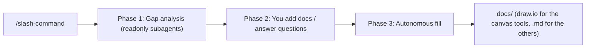

# The Agentic Architect

**The Agentic Architect** equips coding agents with reusable guidance for architectural work - so your agent ([Cursor](https://cursor.com/docs) or [Claude Code](https://code.claude.com/docs)) can genuinely assist software and solution architects and development teams, not just write code. It is a growing toolbelt of skills and subagents, each focused on one architecture task, each usable on its own, and each invoked as a single slash command.

Every tool analyzes your repository as a **black box** - no assumptions about language, framework, or layout - and follows an evidence-or-gap rule: every statement cites a real artifact, and anything that can't be derived from the repo is marked as a gap rather than invented.

## The problem it solves

Architecture documentation has two chronic failure modes:

- **It's never current.** Docs are written once, then drift away from the code as the system evolves. Within months the diagrams and decisions describe a system that no longer exists.
- **It's cumbersome to create for an existing codebase.** Reverse-engineering the architecture, domain language, and boundaries of a large or unfamiliar repo by hand is slow, tedious, and easy to get wrong.

The Agentic Architect attacks both: because the documentation is **generated from the code itself** by your coding agent, it's cheap to (re)create on demand - re-run a tool whenever the code changes and the artifact catches up. And because every statement is backed by evidence from the repo, you get an accurate starting point for a brand-new or inherited codebase in minutes instead of weeks.

## Tools on the belt (in the recommended order of execution)

### 1. `/analyze-commits`

**Goal:** diagnose a repository from its **git history before reading any code** - which files to read first, and what to be careful of.

It runs the five diagnostics from Ally Piechowski's [The Git Commands I Run Before Reading Any Code](https://piechowski.io/post/git-commands-before-reading-code/) - code-churn hotspots, contributors and bus factor, bug clusters, project velocity, and firefighting/crisis patterns - cross-references churn against bugs to surface the highest-risk files, and assembles everything into a single Markdown report with a verdict and explicit data caveats. The result lands in `docs/commit-analysis.md`.

This tool is **independent of the others and can be run at any time** - it only needs git history, not the other artifacts. It's **recommended as the first step**, though: it gives you your bearings before you read any code, and `/build-architecture-communication-canvas` consumes its output (when present) to enrich the Risks section. If it hasn't been run, the canvas tool offers to run it upfront during gap analysis.

Sample output: [Markdown](analyze-commits/example-commit-analysis.md)

### 2. `/build-architecture-communication-canvas`

**Goal:** capture "the shortest possible description of your architecture" by filling out the [arc42 Architecture Communication Canvas (ACC)](https://canvas.arc42.org/architecture-communication-canvas) for any repository.

Nine category subagents scan the codebase, report what's derivable versus missing, let you fill the gaps, then assemble a single evidence-backed canvas with all nine ACC sections. **By default only the draw.io canvas is generated** - an editable `docs/architecture-communication-canvas.drawio` (the original arc42 ACC layout), which is the **single source of truth**. The other formats are optional and can be generated **afterwards**, on request, each regenerated from the draw.io by its own renderer: a `docs/architecture-communication-canvas.md` (Markdown/Mermaid), a one-page `docs/architecture-communication-canvas.html` overview, and a full-page `docs/architecture-communication-canvas.png` snapshot **rendered from the HTML** (via headless Chrome).

Sample output: [Markdown](build-architecture-communication-canvas/example-architecture-communication-canvas.md) · [HTML](build-architecture-communication-canvas/example-architecture-communication-canvas.html) · [draw.io](build-architecture-communication-canvas/example-architecture-communication-canvas.drawio)

[](build-architecture-communication-canvas/example-architecture-communication-canvas.png)

### 3. `/discover-ubiquitous-language`

**Goal:** surface the [Domain-Driven Design ubiquitous language](https://martinfowler.com/bliki/UbiquitousLanguage.html) **as it actually appears in the code** - the real domain nouns, verbs, statuses, and events.

It produces a domain-expert review artifact (a rough domain classification, a plain-language keyword/definition glossary, and explicit discussion points) so you can sit down with non-technical domain experts and find gaps and misunderstandings between code and domain. The result lands in `docs/ubiquitous-language.md`.

Sample output: [Markdown](discover-ubiquitous-language/example-ubiquitous-language.md)

### 4. `/define-bounded-contexts`

**Goal:** identify the [Domain-Driven Design bounded contexts](https://martinfowler.com/bliki/BoundedContext.html) and the **context map** (how those contexts relate), and fill out a [Bounded Context Canvas](https://github.com/ddd-crew/bounded-context-canvas) for each one.

It scans the code black-box and, where available, folds in the outputs of the two tools above to draw boundaries from product vision and domain language, not just folder structure. When neither input exists it asks whether to run those tools first or proceed code-only (lower quality). **By default only draw.io is generated**: one editable Bounded Context Canvas (V5 layout) per context under `docs/bounded-contexts/<context>.drawio` - each the **single source of truth** for that context - plus a `docs/bounded-contexts/context-map.drawio` of the relationships and their classic patterns (Customer/Supplier, ACL, Open Host Service, ...). The other formats are optional and can be generated **afterwards**, on request, each regenerated from the per-context draw.io by its own renderer: Markdown (per-context canvases + a `docs/bounded-contexts.md` index), HTML overviews, and PNG snapshots **rendered from the HTML**.

Sample output: index [Markdown](define-bounded-contexts/example-bounded-contexts.md) · per-context canvas [Markdown](define-bounded-contexts/example-bounded-contexts/sales.md) · [HTML](define-bounded-contexts/example-bounded-contexts/sales.html) (also [billing](define-bounded-contexts/example-bounded-contexts/billing.html), [delivery](define-bounded-contexts/example-bounded-contexts/delivery.html), [identity](define-bounded-contexts/example-bounded-contexts/identity.html))

[](define-bounded-contexts/example-bounded-contexts/sales.png)

More tools (e.g. architecture review) will follow as additional top-level folders.

### Recommended order

The tools stand alone, but they compose - later tools get richer when earlier outputs exist. For a fresh or inherited repo, run them in this order:

1. **`/analyze-commits`** - get your bearings before reading any code: which files are risky, who knows the system, and where it's heading. Pure git-history diagnostics, **independent of the others and runnable at any time**; running it first lets `/build-architecture-communication-canvas` reuse its findings for the Risks section.
2. **`/build-architecture-communication-canvas`** - establish the big picture: value proposition, stakeholders, components, decisions, and quality goals.
3. **`/discover-ubiquitous-language`** - extract the real domain vocabulary from the code, then validate it with domain experts.
4. **`/define-bounded-contexts`** - draw the bounded contexts and context map, informed by the product vision (from step 2) and the domain language (from step 3).

`/define-bounded-contexts` will detect and fold in the outputs of steps 1-2 automatically; if they're missing it offers to run them first or proceed code-only (lower quality).

## How a tool runs

Each tool is built the same way: an orchestrator skill invoked by its slash command, plus a set of readonly subagents that scan the repo in parallel. A typical run does a gap analysis (what's derivable from the code versus what's missing), pauses for you to add any missing docs or answer questions, then autonomously assembles the output - marking anything still unknown as a clearly-labelled `> TODO (human input needed)` placeholder rather than inventing it.



### Why subagents + skills?

- **Subagents** (Cursor [docs](https://cursor.com/docs/subagents) / Claude Code [docs](https://code.claude.com/docs/en/sub-agents)) give each category its own context window, so the noisy repo scanning never bloats the main conversation. One subagent per category keeps the work transparent and independently improvable.
- **Skills** (Cursor [docs](https://cursor.com/docs/skills) / Claude Code [docs](https://code.claude.com/docs/en/skills)) carry the reusable knowledge (templates, discovery heuristics, question banks) and load progressively. Each entrypoint is a skill with `disable-model-invocation: true`, so it installs via the skills standard but is still invoked as a slash command.

## Install

The `install.sh` script copies the toolkit's skills and subagents into the right place for your coding agent. Pick one or more agents (`--cursor`, `--claude`) and exactly one scope (`--user` for all your projects, `--target <dir>` for a single project).

### Option A - run directly from GitHub (no checkout needed)

```bash
# Cursor, user-scoped (all your projects):
curl -fsSL https://raw.githubusercontent.com/andiveloper/the-agentic-architect/main/install.sh | bash -s -- --cursor --user

# Claude Code, into a specific project:
curl -fsSL https://raw.githubusercontent.com/andiveloper/the-agentic-architect/main/install.sh | bash -s -- --claude --target /path/to/your/project
```

### Option B - from a local checkout

```bash
git clone https://github.com/andiveloper/the-agentic-architect.git
cd the-agentic-architect

# Cursor + Claude Code into another project (project-scoped):
./install.sh --cursor --claude --target /path/to/your/project

# Or user-scoped (all your projects):
./install.sh --cursor --user
```

Per agent, the script installs into:

| Agent | Flag | Skills | Subagents |
| --- | --- | --- | --- |
| Cursor | `--cursor` | `<base>/.cursor/skills/` | `<base>/.cursor/agents/` |
| Claude Code | `--claude` | `<base>/.claude/skills/` | `<base>/.claude/agents/` |

where `<base>` is `$HOME` (`--user`) or your `--target` directory. Run `./install.sh --help` for all options.

## Usage

1. Open the repository you want to document in your coding agent (Cursor or Claude Code).
2. Run the slash command for the tool you want:
   - `/analyze-commits` → `docs/commit-analysis.md`
   - `/build-architecture-communication-canvas` → `docs/architecture-communication-canvas.drawio` (default; `.md`, `.html`, `.png` optional on request)
   - `/discover-ubiquitous-language` → `docs/ubiquitous-language.md`
   - `/define-bounded-contexts` → `docs/bounded-contexts/<context>.drawio` + `docs/bounded-contexts/context-map.drawio` (default; Markdown/HTML/PNG optional on request)
3. Answer the gap report inline (add docs or answer questions, or skip).
4. Review the generated file(s) and resolve any `TODO (human input needed)` placeholders.

The tools compose: `/build-architecture-communication-canvas` consumes `/analyze-commits`' output for its Risks section (and offers to run it upfront if missing), and `/define-bounded-contexts` optionally consumes the canvas and ubiquitous-language outputs - so running them in the [recommended order](#recommended-order) yields the richest result.

## What's in this repo

The toolkit is agent-neutral: each tool lives in a single top-level folder, and `install.sh` maps the source files into each coding agent's directories. Future toolkits (e.g. `architecture-review/`) will be added as sibling top-level folders.

```
build-architecture-communication-canvas/         # the ACC tool
  skills/
    build-architecture-communication-canvas/      # orchestrator entrypoint
    arc42-acc-canvas/                              # canvas templates (md + html + drawio) + conventions
    acc-canvas-png/                                # HTML -> full-page PNG via headless Chrome (script)
    repo-discovery/                                # black-box discovery heuristics
    acc-gap-analysis/                              # inputs catalog + question bank
  agents/
    acc-value-proposition.md ... acc-risks-missing-info.md   # 9 category subagents
    acc-canvas-drawio.md                           # builds the draw.io canvas (source of truth, default output)
    acc-canvas-markdown.md                         # derives the Markdown view from the draw.io (optional)
    acc-canvas-html.md                             # derives the HTML overview from the draw.io (optional)
  example-architecture-communication-canvas.md     # sample output (Markdown/Mermaid)
  example-architecture-communication-canvas.html   # sample output (HTML overview)
  example-architecture-communication-canvas.drawio # sample output (draw.io canvas)
  example-architecture-communication-canvas.png    # sample output (HTML rendered to PNG)
discover-ubiquitous-language/                     # the DDD ubiquitous-language tool
  skills/
    discover-ubiquitous-language/                  # orchestrator entrypoint
    ddd-ubiquitous-language/                       # DDD term heuristics + output template
  agents/
    ul-domain-extractor.md                         # per-area term-extraction subagent
  example-ubiquitous-language.md                   # sample output (Markdown)
define-bounded-contexts/                          # the DDD bounded-context + context-map tool
  skills/
    define-bounded-contexts/                       # orchestrator entrypoint
    ddd-bounded-contexts/                          # boundary signals + relationship patterns + canvas templates (drawio + md + html) + index template
  agents/
    bc-context-analyzer.md                         # per-context canvas subagent
    bc-canvas-drawio-renderer.md                   # builds the draw.io canvas per context (source of truth, default)
    bc-canvas-markdown-renderer.md                 # derives the Markdown view per context from the draw.io (optional)
    bc-canvas-html-renderer.md                     # derives the HTML overview per context from the draw.io (optional)
  example-bounded-contexts.md                      # sample index output (Markdown)
  example-bounded-contexts/                        # sample per-context canvases (Markdown + HTML + PNG preview)
analyze-commits/                                  # the git-history diagnostics tool
  skills/
    analyze-commits/                               # orchestrator entrypoint
    git-history-diagnostics/                       # exact git commands + interpretation rules + output template
  agents/
    commit-churn-analyst.md ... commit-firefighting-analyst.md  # 5 per-diagnostic subagents (one git command each)
  example-commit-analysis.md                       # sample output (Markdown)
install.sh
```

## License

[Apache License 2.0](LICENSE)

## Credits

The Architecture Communication Canvas is by Gernot Starke, Patrick Roos and arc42 contributors - <https://canvas.arc42.org/architecture-communication-canvas>.

The Bounded Context Canvas is by the DDD Crew and contributors (CC BY 4.0) - <https://github.com/ddd-crew/bounded-context-canvas>.

The `/analyze-commits` diagnostics are based on Ally Piechowski's "The Git Commands I Run Before Reading Any Code" - <https://piechowski.io/post/git-commands-before-reading-code/>.
