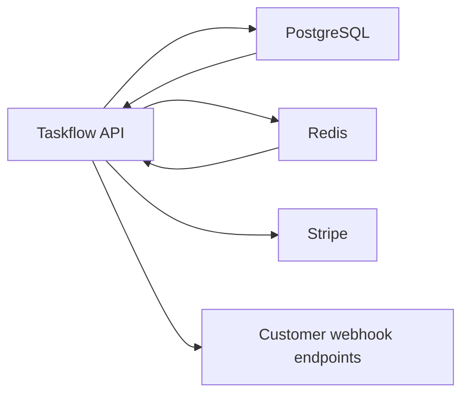
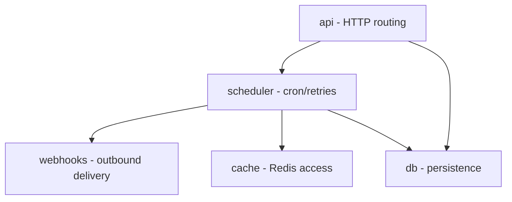

<!--
Example output from The Agentic Architect for a fictional "Taskflow API" repository.
Illustrates the conventions: Confidence line, evidence tags, Inferred: markers, and TODO placeholders.
Render with the VSCode "Markdown Preview Enhanced" extension or on GitHub (mermaid is supported there).
-->

# Architecture Communication Canvas - Taskflow API

*System: Taskflow API | Created by: The Agentic Architect | Created for: TODO (audience) | Date / Iteration: 2026-06-02 | Repository: github.com/example/taskflow-api*

> The shortest possible description of this architecture.

## Value Proposition 💼
*Major objectives. What value does the system deliver? What are the major business goals?*

Confidence: medium

- Provides a hosted REST API for creating, scheduling, and tracking background tasks for small SaaS teams (source: README.md, docs/product-brief.md).
- Inferred: positioned as a lightweight alternative to heavier workflow engines (evidence: README.md "lightweight" tagline).
- > TODO (human input needed): State the primary business goal / economic driver (revenue model, internal cost saving, etc.).

## Core Functions 📋
*What are the most important functions? What activities or processes does it offer?*

Confidence: high

- Create and schedule tasks via REST (evidence: src/routes/tasks.ts).
- Recurring task definitions with cron expressions (evidence: src/scheduler/cron.ts).
- Webhook callbacks on task completion (evidence: src/webhooks/).
- Task status querying and history (evidence: src/routes/status.ts).
- Inferred: scheduling reliability is the highest-value function (evidence: largest test suite under tests/scheduler/).

## Key Stakeholder 🧑‍🧑‍🧒
*For whom are we creating value? Who is paying for development? Who is paying for operations? Who are our most important customers? Who are our most important contributors?*

Confidence: medium

- Contributors: 4 maintainers listed (evidence: CODEOWNERS, AUTHORS).
- Customers / sponsors: (source: user input) early-stage SaaS teams; sponsored by the Platform team.
- > TODO (human input needed): Confirm who pays for operations and the largest customer segments.

## Quality Requirements ⭐️
*Speed, scalability, reliability, usability, security, safety, capacity or similar.*

Confidence: medium

- Reliability: retry-with-backoff on task execution (evidence: src/scheduler/retry.ts).
- Performance: Redis caching of task lookups (evidence: src/cache/redis.ts); load test present (evidence: tests/load/k6.js).
- Security: JWT (JSON Web Token) auth middleware and input validation (evidence: src/middleware/auth.ts, src/middleware/validate.ts).
- > TODO (human input needed): Provide concrete targets (e.g. p99 latency, availability SLO (Service Level Objective)) - none are stated in the repo.

## Business Context 🔗
*What are the most important external interfaces or neighboring systems?*

Confidence: high

Context diagram: Taskflow API and its neighbouring systems (arrows show data direction).

- PostgreSQL - primary datastore (sink/source) (evidence: docker-compose.yml, src/db/).
- Redis - cache and queue broker (evidence: docker-compose.yml, src/cache/redis.ts).
- Stripe - billing integration (evidence: src/integrations/stripe.ts, .env.example STRIPE_KEY).
- Customer webhook endpoints - outbound (evidence: src/webhooks/).
- > TODO (human input needed): Which neighbours are most business-critical or costly?

## Core Decisions - Good or Bad 🚦
*Which decisions lead to the current state of the system?*

Confidence: low

- ADR-0001 (ADR = Architecture Decision Record): Use Redis as both cache and queue (evidence: docs/adr/0001-redis-as-queue.md).
- Inferred: monorepo with a single deployable service (evidence: single package.json, no workspace manifest).
- > TODO (human input needed): Which decisions are you proud of vs. regret? No verdicts are recorded in the ADRs.

## Technologies 🛠️
*Important technologies used for development and operation.*

Confidence: high

- Languages: TypeScript / Node.js (evidence: package.json, tsconfig.json, .nvmrc).
- Frameworks/libraries: Express, BullMQ, Zod (evidence: package.json).
- Data/middleware: PostgreSQL, Redis (evidence: docker-compose.yml).
- Infrastructure / CI (Continuous Integration): Docker, GitHub Actions (evidence: Dockerfile, .github/workflows/ci.yml).
- Observability: pino logging (evidence: src/logger.ts).
- > TODO (human input needed): Hosting/datacenter and monitoring stack are not described in the repo.

## Components / Modules 🧊
*Major building blocks of the system.*

Confidence: high

Component diagram: the major modules and their dependencies (arrows show "depends on / calls").

- `api` - HTTP routing and request handling (evidence: src/routes/).
- `scheduler` - cron parsing, execution, retries (evidence: src/scheduler/).
- `webhooks` - outbound delivery (evidence: src/webhooks/).
- `db` - persistence layer (evidence: src/db/).
- `cache` - Redis access (evidence: src/cache/).

## Core Risks and Missing Information ❓
*Potential problems and risks? What information is missing or has gotten lost? What is hindering the team from delivering better value faster?*

Confidence: medium

### Risks

- 23 TODO/FIXME markers, concentrated in src/scheduler/ (evidence: grep TODO/FIXME).
- One dependency flagged deprecated (evidence: npm warning for `request@2`).
- No integration tests for webhook delivery (evidence: tests/ contains only unit + load).
- Inferred: Redis is a single point of failure for both cache and queue (evidence: ADR-0001, docker-compose.yml single redis service).

### Missing information

- Primary business goal / economic driver (from Value Proposition).
- Who pays for operations and largest customer segments (from Key Stakeholder).
- Concrete quality targets / SLOs (from Quality Requirements).
- Business criticality of external neighbours (from Business Context).
- Decision verdicts and rationale (from Core Decisions).
- Hosting and monitoring stack (from Technologies).

---

## Provenance

- Sections primarily from repository evidence: Core Functions, Business Context, Components / Modules, Technologies, Risks.
- Sections primarily from user input / provided documents: Value Proposition, Key Stakeholder.
- Sections with unresolved TODOs: Value Proposition, Key Stakeholder, Quality Requirements, Business Context, Core Decisions, Technologies.

 The Architecture Communication Canvas is by Gernot Starke, Patrick Roos and arc42 contributors, licensed under Attribution-ShareAlike 4.0 International. [https://canvas.arc42.org](https://canvas.arc42.org)
