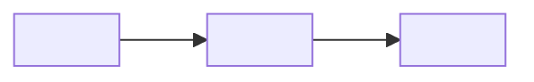
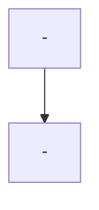

<!--
arc42 Architecture Communication Canvas - Markdown / Mermaid template.
Generated by The Agentic Architect (https://canvas.arc42.org/architecture-communication-canvas).

Based on the arc42 ACC Markdown/Mermaid template (https://canvas.arc42.org).
Render with the VSCode "Markdown Preview Enhanced" extension or on GitHub (mermaid is supported there).

FILL RULES (keep these - they are the tool's evidence-or-gap contract):
- Replace every <...> placeholder. Do NOT change the section order, headings, or emojis.
- Each section body starts with a "Confidence: high | medium | low" line.
- Every derived statement ends with an evidence tag: (evidence: <file>, <file>) - or (source: user input) /
  (source: docs/<doc>.md) for provided inputs.
- Never invent. Anything not derivable becomes: > TODO (human input needed): <specific question>
- Statements that are reasoned rather than directly evidenced start with "Inferred:" and still carry an
  evidence tag for the signals they were inferred from.
- Business Context and Components / Modules lead with a mermaid diagram, then tight evidence bullets.
- Expand every abbreviation on first use, e.g. CI (Continuous Integration).
-->

# Architecture Communication Canvas - <System Name>

*System: <System Name> | Created by: The Agentic Architect | Created for: <audience / TODO> | Date / Iteration: <YYYY-MM-DD> | Repository: <repo identifier or path>*

> The shortest possible description of this architecture.

## Value Proposition 💼
*Major objectives. What value does the system deliver? What are the major business goals?*

Confidence: <high|medium|low>

<content with evidence tags, or `> TODO (human input needed): ...`>

## Core Functions 📋
*What are the most important functions? What activities or processes does it offer?*

Confidence: <high|medium|low>

<content>

## Key Stakeholder 🧑‍🧑‍🧒
*For whom are we creating value? Who is paying for development? Who is paying for operations? Who are our most important customers? Who are our most important contributors?*

Confidence: <high|medium|low>

<content>

## Quality Requirements ⭐️
*Speed, scalability, reliability, usability, security, safety, capacity or similar.*

Confidence: <high|medium|low>

<content>

## Business Context 🔗
*What are the most important external interfaces or neighboring systems?*

Confidence: <high|medium|low>

Context diagram: <System Name> and its neighbouring systems / actors (arrows show data direction).

<concise evidence bullets: each neighbour/actor with direction (source/sink) and `(evidence: ...)`, or `> TODO (human input needed): ...`>

## Core Decisions - Good or Bad 🚦
*Which decisions lead to the current state of the system?*

Confidence: <high|medium|low>

<content>

## Technologies 🛠️
*Important technologies used for development and operation.*

Confidence: <high|medium|low>

<content>

## Components / Modules 🧊
*Major building blocks of the system.*

Confidence: <high|medium|low>

Component diagram: the major building blocks and their dependencies (arrows show "depends on / calls").

<concise evidence bullets: each block with a one-line responsibility and `(evidence: ...)`>

## Core Risks and Missing Information ❓
*Potential problems and risks? What information is missing or has gotten lost? What is hindering the team from delivering better value faster?*

Confidence: <high|medium|low>

### Risks

<risk findings with evidence tags>

### Missing information

<de-duplicated union of unresolved TODO/gap items from all sections>

---

## Provenance

- Sections primarily from repository evidence: <list>
- Sections primarily from user input / provided documents: <list>
- Sections with unresolved TODOs: <list>

 The Architecture Communication Canvas is by Gernot Starke, Patrick Roos and arc42 contributors, licensed under Attribution-ShareAlike 4.0 International. [https://canvas.arc42.org](https://canvas.arc42.org)
