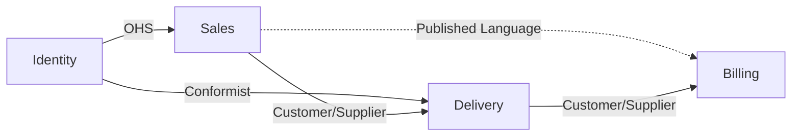

<!--
Bounded Contexts & Context Map - discovered from code
Generated by The Agentic Architect (define-bounded-contexts)
This is an illustrative sample for a fictional commerce/delivery system (the same ShopFlow used in the ubiquitous-language sample).
-->

# Bounded Contexts - ShopFlow

- Repository: github.com/example/shopflow
- Generated: 2026-06-02
- Generated by: The Agentic Architect (define-bounded-contexts)
- Inputs used: docs/architecture-communication-canvas.md, docs/ubiquitous-language.md

> These are the bounded contexts and their relationships **as the code currently reveals them**. Review and refine them with architects and the team. Boundaries are evidence-backed; weakly evidenced ones are marked `Inferred:` and low-confidence.

---

## Bounded contexts

One section per context: the capability it owns, its core model/language, the data it owns, and its subdomain type.

### Sales

- Confidence: high
- Paths: `src/orders/`, `src/cart/` (evidence: src/orders/, src/cart/)
- Responsibility: Capture what a customer wants to buy and turn it into a confirmed order.
- Core model / language: `Order`, `OrderLine`, `Cart`, `Backordered`, `OrderPlaced` (evidence: src/orders/Order.kt, src/orders/events/OrderPlaced.kt)
- Owned data: `orders` schema (`orders`, `order_lines` tables) (evidence: db/migrations/V3__orders.sql)
- Subdomain type: core

### Delivery

- Confidence: high
- Paths: `src/delivery/` (evidence: src/delivery/)
- Responsibility: Get confirmed orders physically shipped to customers via couriers.
- Core model / language: `Shipment`, `DeliveryNote`, `Courier`, `Dispatch` (evidence: src/delivery/Shipment.kt, src/delivery/DispatchService.kt)
- Owned data: `delivery` schema (`shipments`, `delivery_notes` tables) (evidence: db/migrations/V5__delivery.sql)
- Subdomain type: core

### Billing

- Confidence: high
- Paths: `src/billing/` (evidence: src/billing/)
- Responsibility: Issue invoices, take payment, and process refunds for orders and deliveries.
- Core model / language: `Invoice`, `Settle`, `Refund`, `Tariff` (evidence: src/billing/Invoice.kt, src/billing/Tariff.kt)
- Owned data: `billing` schema (`invoices`, `refunds` tables) (evidence: db/migrations/V7__billing.sql)
- Subdomain type: supporting

### Identity

- Confidence: medium
- Paths: `src/shared/auth/` (evidence: src/shared/auth/)
- Responsibility: Authenticate users and resolve who a `Customer` or `Merchant` is.
- Core model / language: `Customer`, `Merchant`, `User`, `Session` (evidence: src/shared/Customer.kt, src/shared/auth/Session.kt)
- Owned data: `identity` schema (`users`, `sessions` tables) (evidence: db/migrations/V1__users.sql)
- Subdomain type: generic

---

## Context map

How the contexts integrate. Patterns: Partnership, Shared Kernel, Customer/Supplier, Conformist, Anti-Corruption Layer (ACL), Open Host Service (OHS), Published Language, Separate Ways. Direction: U = upstream, D = downstream.

| Upstream | Downstream | Pattern | Integration evidence |
| --- | --- | --- | --- |
| Sales | Delivery | Customer/Supplier | `OrderPlaced` event consumed by Delivery (evidence: src/delivery/listeners/OnOrderPlaced.kt) |
| Sales | Billing | Published Language | Shared `OrderConfirmed` event schema (evidence: src/shared/events/OrderConfirmed.kt) |
| Delivery | Billing | Customer/Supplier | Delivery `Tariff` lookups call Billing's API (evidence: src/delivery/BillingClient.kt) |
| Identity | Sales | Open Host Service | Auth/identity exposed via shared `IdentityApi` (evidence: src/shared/auth/IdentityApi.kt) |
| Identity | Delivery | Conformist | Delivery uses Identity's `Customer` model as-is (evidence: src/delivery/Shipment.kt) |
| Sales | Billing | > TODO (human input needed): confirm whether refunds should flow Sales -> Billing or be owned solely by Billing | (evidence: src/billing/Refund.kt) |

---

## Discussion points / possible gaps

Things to clarify and refine with the team:

- **Ambiguous boundary**: `Identity` lives under `src/shared/` and mixes auth with the shared `Customer`/`Merchant` model - is it a true context or a shared kernel? (evidence: src/shared/Customer.kt, src/shared/auth/)
- **Possible merge**: `DeliveryNote` and `Shipment` are used almost interchangeably in `DispatchService`, hinting the Delivery model may be smaller than it looks (evidence: src/delivery/DispatchService.kt).
- **Shared term across contexts**: `Customer` is referenced by Sales, Delivery, and Billing but owned by Identity - confirm Identity is the upstream source of truth (evidence: src/shared/Customer.kt).
- **Undetermined relationship**: see the `TODO (human input needed)` entry in the context map above (refund ownership).
- **Big Ball of Mud risk**: the legacy import in `src/legacy/import.kt` writes directly across the `orders` and `billing` schemas, bypassing context boundaries (evidence: src/legacy/import.kt).

---

## Provenance

- Contexts derived from repository evidence: 4 (Sales, Delivery, Billing, Identity)
- Relationships mapped: 5 (plus 1 unresolved)
- Items with unresolved TODOs (need human input): 1 (refund ownership between Sales and Billing)
