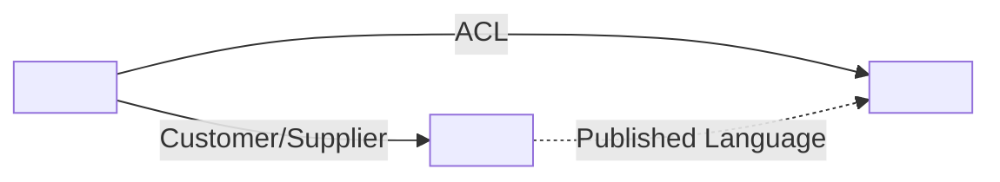

<!--
Bounded Contexts index & Context Map - discovered from code
Generated by The Agentic Architect (define-bounded-contexts)
This is the INDEX file. One Bounded Context Canvas per context lives in docs/bounded-contexts/<context>.md.
Replace every <...> placeholder. Keep context/term names verbatim from the code, evidence tags, and TODO lines.
-->

# Bounded Contexts - <System Name>

- Repository: <repo identifier or path>
- Generated: <YYYY-MM-DD>
- Generated by: The Agentic Architect (define-bounded-contexts)
- Inputs used: <docs/architecture-communication-canvas.md, docs/ubiquitous-language.md, or "code only">

> These are the bounded contexts and their relationships **as the code currently reveals them**. Each context is documented as a [Bounded Context Canvas](https://github.com/ddd-crew/bounded-context-canvas) linked below. Review and refine them with architects and the team. Boundaries are evidence-backed; weakly evidenced ones are marked `Inferred:` and low-confidence.

<!-- Include the following note ONLY if neither ACC nor ubiquitous-language input was available: -->
> Note: derived from **code structure only** - no Architecture Communication Canvas or ubiquitous-language input was available. Boundaries reflect the code, not the product vision or strategy, and should be treated as lower-confidence.

---

## Contexts

One Bounded Context Canvas per context. Open each canvas for its full design.

| Context | Subdomain type | Responsibility | Canvas |
| --- | --- | --- | --- |
| <Context name> | <core/supporting/generic> | <one-line capability> | [canvas](bounded-contexts/<context-slug>.md) |
| <Context name> | <core/supporting/generic> | <one-line capability> | [canvas](bounded-contexts/<context-slug>.md) |

---

## Context map

How the contexts integrate. Patterns: Partnership, Shared Kernel, Customer/Supplier, Conformist, Anti-Corruption Layer (ACL), Open Host Service (OHS), Published Language, Separate Ways. Direction: U = upstream, D = downstream.

| Upstream | Downstream | Pattern | Integration evidence |
| --- | --- | --- | --- |
| <context> | <context> | <pattern> | <client/event/schema> (evidence: <path>) |
| <context> | <context> | <pattern> | > TODO (human input needed): <relationship to confirm> |

---

## Discussion points / possible gaps

Things to clarify and refine with the team:

- **Ambiguous boundary**: <context/area> could be one context or split into <X> / <Y> (evidence: <path>) - confirm.
- **Possible merge**: <context-a> and <context-b> share model/language heavily (evidence: <path>) - one context?
- **Shared term across contexts**: <term> appears in <context-a> and <context-b> with different meaning (evidence: <files>).
- **Undetermined relationship**: see `TODO (human input needed)` entries in the context map above.
- **Big Ball of Mud risk**: <area> shows tangled models with no clear boundary (evidence: <path>).

---

## Provenance

- Contexts derived from repository evidence: <count / short note>
- Relationships mapped: <count>
- Items with unresolved TODOs (need human input): <count / list>
